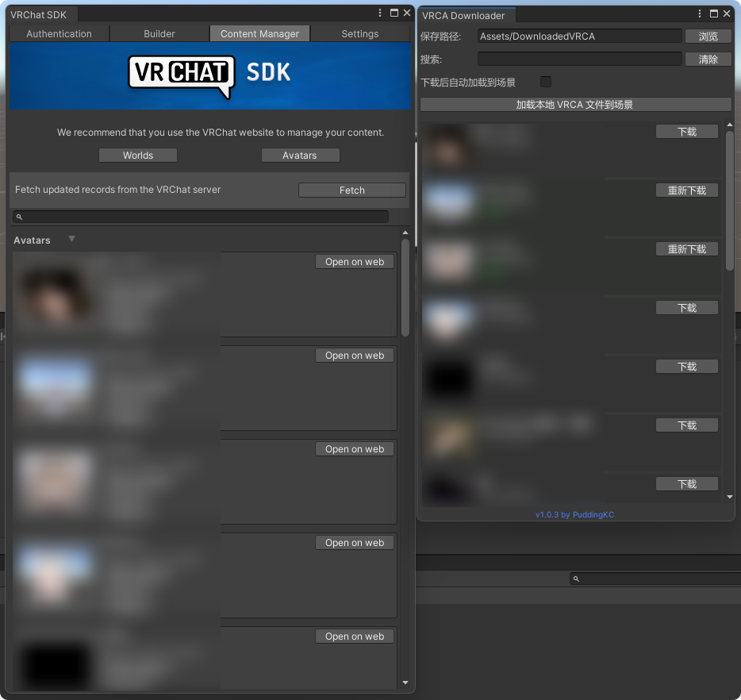

> # 不得恶意使用本工具！  
> **本工具旨在帮助你恢复丢失的资源。**  
> **请不要使用或改造本工具来窃取不属于你的资源！**

---

# VRChat VRCA Downloader - Unity
**VRChat VRCA Downloader - Unity** 是一个用于获取并下载你本人 VRChat 账号下 Avatar (.vrca) 文件的 Unity 插件。  

该工具基于 VRChat SDK 提供的接口获取模型列表，仅用于资源恢复场景。  
整个过程不会存储或上传你的账号信息，所有操作均在本地完成。

安装后打开 `Tools -> VRCA Downloader`

---

# 宇宙免责声明

本工具按“现状”（AS IS）及“可用性”（AS AVAILABLE）原则提供，不附带任何形式的明示或暗示担保，包括但不限于适销性、特定用途适用性、非侵权性、持续可用性或无错误运行的保证。

在适用法律允许的最大范围内，使用本工具即表示你明确理解并同意以下条款：

## 一、使用范围与限制
- 本工具仅限用于学习、研究及个人资源恢复用途。
- 你承诺仅访问、下载或处理你拥有合法所有权或已获得明确授权的资源。
- 严禁将本工具用于任何形式的资源窃取、逆向滥用、未授权分发、商业盗用或规避平台限制的行为。
- 你不得以任何方式修改、扩展或重新分发本工具以实现上述违规用途。

## 二、责任归属
- 你对使用本工具的所有行为、结果及后果承担全部责任。
- 因使用或误用本工具导致的任何直接或间接损失，包括但不限于数据丢失、账号封禁、服务限制、经济损失、声誉损害或法律责任，均由你自行承担。
- 开发者不对任何第三方行为、平台策略变更或服务中断所引发的后果负责。

## 三、数据与隐私
- 本工具不会主动收集、存储或传输任何个人身份信息、账号凭证或下载内容。
- 所有操作默认在本地环境中执行，除非用户主动与外部服务进行交互。
- 尽管如此，开发者不对因用户环境不安全（包括但不限于恶意软件、网络劫持、系统漏洞）导致的信息泄露承担责任。

## 四、与第三方服务的关系
- 本工具可能与第三方服务（包括但不限于 VRChat SDK 或相关接口）进行交互。
- 本工具与任何第三方平台或公司（包括但不限于 VRChat Inc.）不存在从属、合作或授权关系。
- 使用本工具访问第三方服务时，你仍需遵守该平台的所有条款、规则及政策。

## 五、不可预见风险
- 本工具不保证在所有环境、设备或网络条件下均可正常运行。
- 由于技术限制或外部因素，可能出现包括但不限于：功能异常、数据不完整、请求失败、文件损坏等情况。
- 对于由系统更新、接口变更、协议调整或不可抗力（如网络中断、设备故障等）引发的问题，开发者不承担责任。

## 六、法律与合规
- 你有责任确保你的行为符合所在司法辖区的法律法规。
- 若因使用本工具引发任何法律争议、调查或诉讼，相关责任完全由你承担。
- 本工具的提供不构成对任何潜在违规行为的许可或默许。

## 七、责任限制
在适用法律允许的最大范围内，开发者在任何情况下均不对以下损失承担责任，包括但不限于：
- 间接损失、附带损失、特殊损失或惩罚性损害
- 利润损失、业务中断、数据丢失或替代成本
- 因账户处理（如封禁、限制）导致的任何影响
- 因误用、滥用或超出预期用途使用本工具所产生的后果

即使开发者已被告知可能发生上述损失，亦不承担任何责任。

## 八、条款变更
开发者保留在不事先通知的情况下随时修改、更新或移除本免责声明的权利。  
继续使用本工具即视为你接受更新后的条款。

## 九、最终解释权
在法律允许范围内，本免责声明的最终解释权归开发者所有。  
